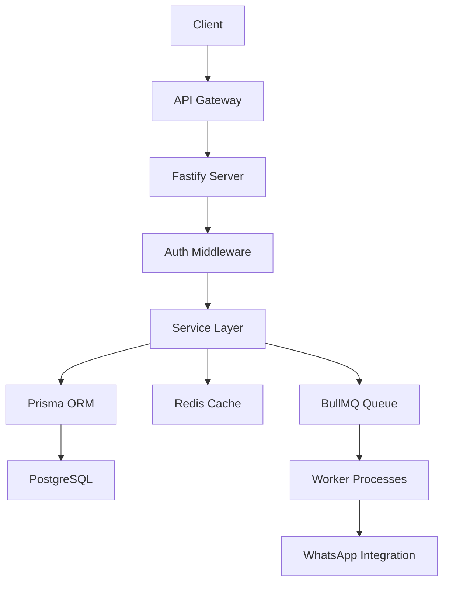

# Plano de Backend Multi‑Tenant

## Visão Geral da Arquitetura

- **Monólito vs Micro‑serviços** – Para o MVP vamos usar um **monólito modularizado** com camadas bem definidas (API, Serviços, Repositório). Caso a necessidade de escalar cresça, podemos extrair módulos críticos (Auth, Payments, Reports) para micro‑serviços.
- **Framework** – Node.js + TypeScript com **Fastify** (alta performance) e **Prisma** ORM para PostgreSQL.
- **Multi‑Tenant** – Estratégia **single‑database / schema‑per‑tenant** usando o campo `tenantId` em todas as tabelas. Cada request inclui o `tenantId` (via sub‑domínio ou header) e um **middleware** injeta o contexto de tenant.
- **Autenticação** – JWT signed com RS256. Refresh token armazenado em HTTP‑only cookie.
- **Camada de Serviços** – Serviços de domínio (`FinanceiroService`, `AgendaService`, etc.) expõem métodos reutilizáveis usados pelos controladores.
- **Cache** – Redis para sessões, rate‑limit, resultados de relatórios frequentes.
- **Fila assíncrona** – BullMQ para jobs de geração de relatórios e disparo de mensagens WhatsApp.
- **CI/CD** – GitHub Actions com lint, testes, build Docker e deploy ao Azure App Service.

## Endpoints Principais (REST)
| Método | Rota | Descrição |
|--------|------|-----------|
| POST | `/api/auth/login` | Login e geração de JWT |
| POST | `/api/auth/refresh` | Refresh token |
| GET | `/api/agenda` | Lista de agendamentos do tenant |
| POST | `/api/agenda` | Cria novo agendamento |
| GET | `/api/financeiro/summary` | Totais mensais, formas de pagamento |
| POST | `/api/comandas` | Cria/atualiza comandas |
| GET | `/api/comissoes` | Calcula comissões por profissional |
| GET | `/api/estoque` | Consulta estoque |
| POST | `/api/whatsapp/send` | Dispara mensagem mock (future integration) |
| GET | `/api/reports/:type` | Gera relatório PDF/CSV |

## Diagramas

## Estratégias de Escalabilidade
- **Read Replicas** para PostgreSQL em alta demanda.
- **Horizontal scaling** de workers via Kubernetes.
- **Rate‑limiting** por tenant usando Redis token bucket.
- **Feature Flags** (LaunchDarkly style) para rollout gradual de novos módulos.

## Segurança
- **CORS** configurado por tenant origin.
- **Helmet** para hardening de headers.
- **Rate limiting** e **IP ban** para endpoints sensíveis.
- **Audit log** (MongoDB) para ações críticas.
- **Data encryption at rest** via PostgreSQL `pgcrypto` para informações sensíveis.

## Próximos Passos
1. Configurar **Prisma schema** com tabelas multi‑tenant.
2. Implementar **Auth middleware** que extrai `tenantId` e valida JWT.
3. Criar **Dockerfile** e **docker‑compose** para dev ambiente.
4. Definir pipeline GitHub Actions.
5. Documentar fluxos de onboarding de tenant.

---
*Este documento será mantido em `docs/backend-plan.md` e atualizado à medida que a arquitetura evolui.*
